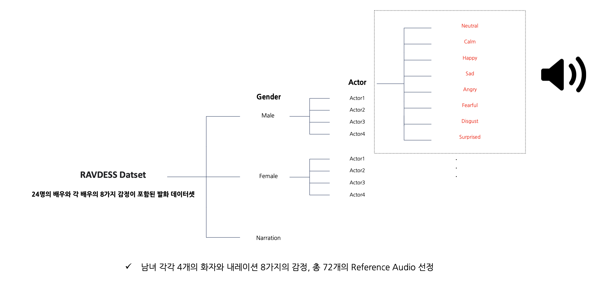

# Emotional-TTS

해당 Repository는 [Offical StyleTTS2](https://github.com/yl4579/StyleTTS2)의 코드를 참고 및 사용했습니다.


## 환경설정
0. 사용한 Docker Image
```shell
docker pull pytorch/pytorch:2.0.1-cuda11.7-cudnn8-runtime
```
1. Python >= 3.7
2. Git으로 Repository 클론
```shell
git clone https://github.com/AI-LeGo/Emotional-TTS
cd Emotional-TTS
```
3. Ubuntu 환경에서 Python Requirements 설치
```shell
pip install -r requirements
```
4. (Option) phonemizer과 espeak 설치
```shell
pip install phonemizer
apt-get install espeak-ng
```  

## 참조 음성 데이터셋
1. [RAVDESS](https://www.kaggle.com/datasets/uwrfkaggler/ravdess-emotional-speech-audio?resource=download) 데이터셋 다운로드
2. `Emotional-TTS/ref_audio/` 폴더 설정
```shell
mkdir -p Emotional-TTS/ref_audio/narrator
mkdir -p Emotional-TTS/ref_audio/male
mkdir -p Emotional-TTS/ref_audio/female
```
3. RAVDESS 데이터셋에서 화자마다 8개의 감정 선정
4. 선정된 화자의 감정 참조 음성 파일을 `Emotional-TTS/ref_audio` 경로에 저장  



## 실행(Inference)
LeGo의 [Service-Backend](https://github.com/AI-LeGo/Service-Backend)로 추출된 JSON 데이터를 `Emotional-TTS/json`에 저장 후, 아래 코드를 실행
```shell
python inference.py
```


## 참조
- StyleTTS2: https://github.com/yl4579/StyleTTS2
- RAVDESS Dataset: https://www.kaggle.com/datasets/uwrfkaggler/ravdess-emotional-speech-audio?resource=download